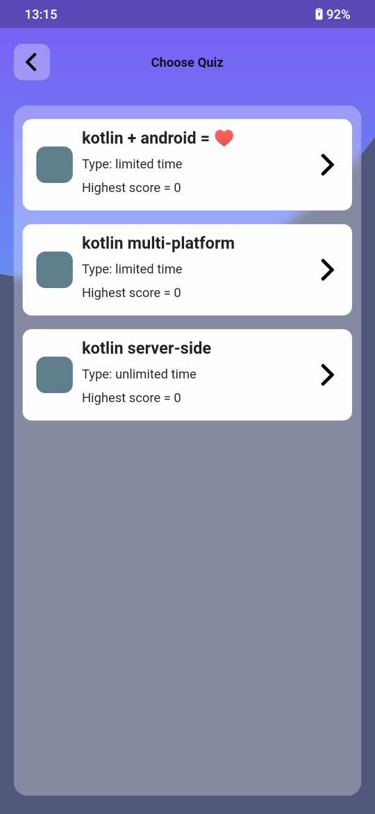
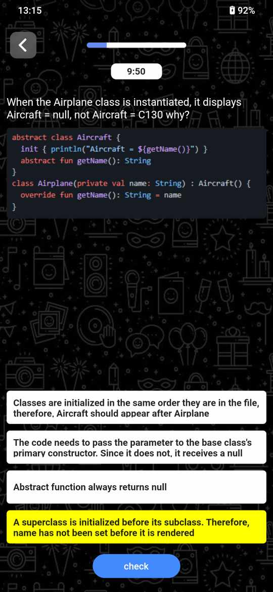
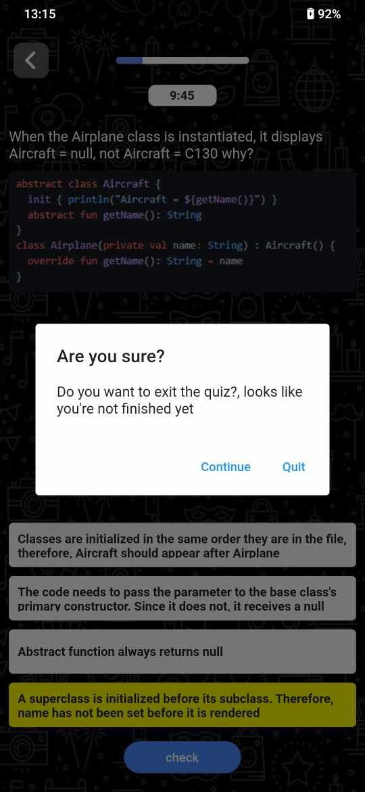
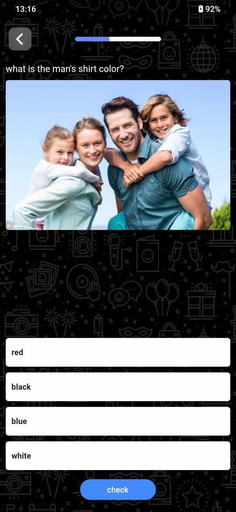

# quiz_app

A new Flutter project.

## About 🍕
### 1, Tech Stack
-	MVVM pattern with clean architecture approach
-   Firebase auth
-	Dependency injection: GetIt
-	State management: Provider
-	Local Db: Hive

### 2, Features
-	Easily integration with native platform
-	different type of quizzes, (limit time, unlimit time, text only, text with image... )

## Demo 😊

https://user-images.githubusercontent.com/85553681/203713486-ad429799-4328-49df-9f97-71da6faa34bd.mp4

## Screenshots 🎁

|🍔|🍕|😍|              
|:-:|:-:|:-:|
|    |    |    |
|    |    |    |

 

# Time consumed 😐
- Nov 6, 2022 - Nov 24, 2022

